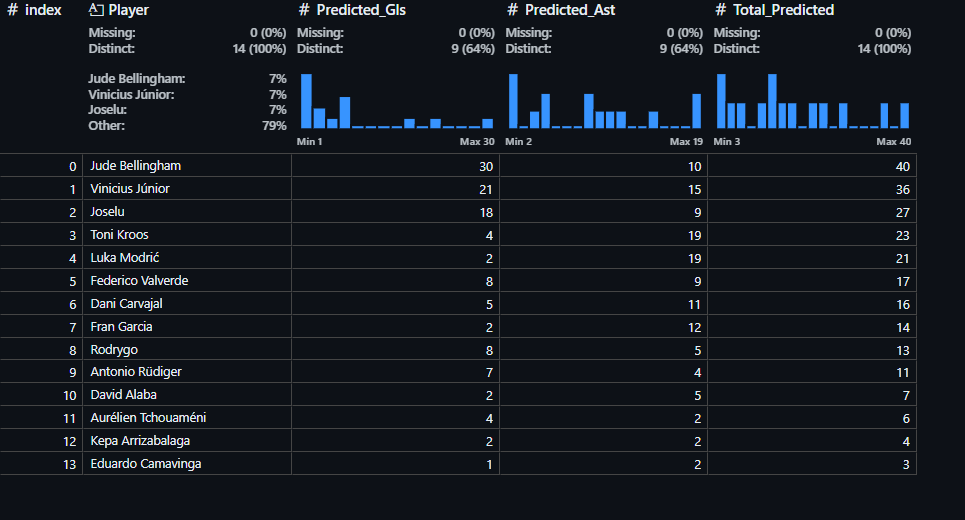

# Kroosify

## Table of Contents

- [Overview](#overview)
- [Features](#features)
- [Machine Learning Model](#machine-learning-model)
- [Usage](#usage)
- [Results](#results)
- [Contributing](#contributing)
- [Acknowledgements](#acknowledgements)

## Overview
Welcome to the **Kroosify**! This repository provides tools and scripts for analyzing and visualizing football statistics, focusing primarily on player performance. This repository includes machine learning models for predictive analysis, insightful data visualizations, and data preprocessing to enhance analytical capabilities. Whether you're a football analyst, a fan, or involved in team management, this repository serves as a comprehensive resource for understanding player contributions and optimizing performance.

### Importance for Analysts and Fans
The insights generated by this analysis can aid football analysts and enthusiasts in various ways:
- **Performance Insights**: By evaluating players' historical data, fans and analysts can better understand individual contributions to the team's success.
- **Transfer Market Strategy**: The predictive capabilities of the model can help teams make informed decisions during the transfer window, identifying potential signings who may excel based on past performance metrics. This can be particularly useful for fantasy leagues and team selections.

## Features
- **Data Augmentation**: Handles NaN values and visualizes data relationships.
- **Predictive Analysis**: Uses a linear regression model to predict goals and assists based on previous season metrics.
- **Data Visualizations**: Detailed statistical insights into player performance and team dynamics.

## Machine Learning Model
The repository includes a machine learning model tailored for predicting player performance based on various metrics such as:
- Matches Played (MP)
- Minutes Played (Min)
- Goals Scored (Gls)
- Assists (Ast), etc.

The model employs a random forest regression approach to make predictions about goals and assists for the current season, ranking them in descending order.

## Usage

### Data Training
- **Data Source**: Model training data is sourced from the `player_data.csv` file.
- **Training Script**: Use the `Data_Augmentation.ipynb` script to preprocess the data, train the model, and evaluate its performance.

### Model Prediction
- **Prediction Script**: Utilize the `Model_Training.ipynb` script to make predictions on player performance after a specified number of matches. This script also uses the `player_data.csv` file, but you can use the `player_data_final.csv` saved from the augmentation model to provide insights into future player statistics.

## Getting Started
To get started with the Real Madrid Stats Analyzer and explore football data analysis:

1. Clone this repository to your local machine.
2. Run the Jupyter notebooks (`Data_Augmentation.ipynb` and `Model_Training.ipynb`) to train the model and perform predictions.

## Results

## Contributing
Contributions are welcome! Please feel free to submit a pull request or open an issue for any suggestions or improvements.

## Acknowledgments
Thanks to all contributors and the football data community for their insights and datasets.
