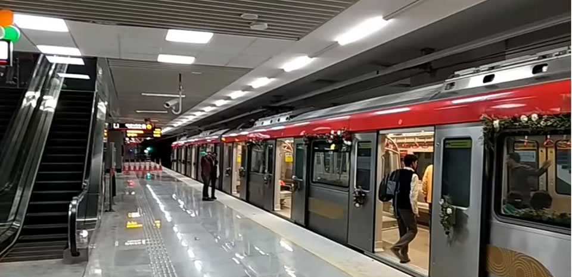
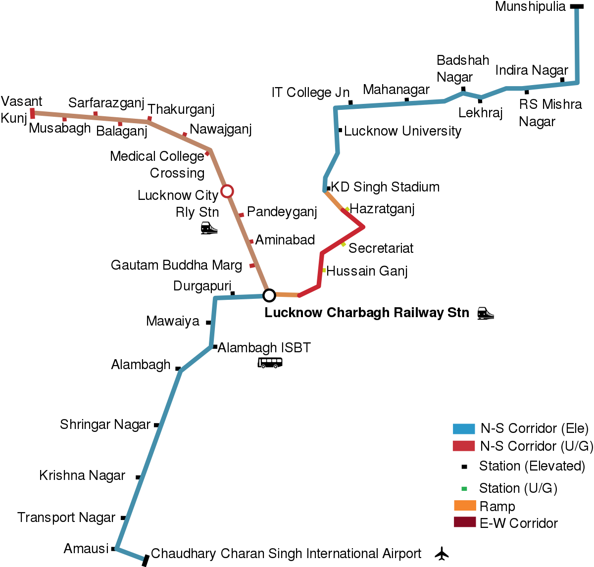
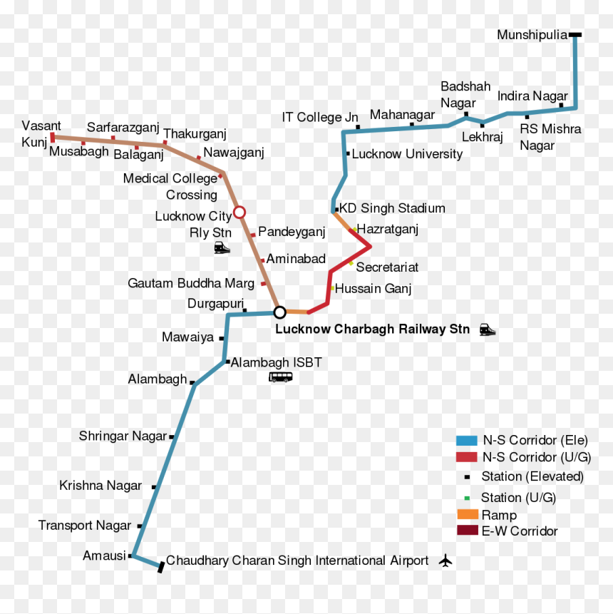
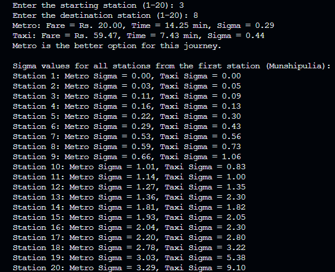

# Metrouter

## Table of Contents
- [Overview](#overview)
- [Project Structure](#project-structure)
- [Lucknow Metro Route Map](#lucknow-metro-route-map)
- [Station Information](#station-information)
- [Why Metro Travel Wins](#why-metro-travel-wins)
- [Usage](#usage)
- [Future Enhancements](#future-enhancements)
- [Contributions](#contributions)

## Overview

Welcome to **Metrouter**! This project aims to demonstrate how travelling by Lucknow Metro is generally economically and temporally advantageous compared to taking a taxi. The project provides a comparative analysis between the two modes of transport, using station-to-station fare and time data to recommend the optimal travel option for any journey across the metro network.

### Inspiration

Lucknow Metro has been running at a significant loss, reporting a deficit of ₹1363 crore as of March 2023. To help address this issue and encourage more metro usage, this project illustrates the clear benefits of choosing metro travel over taxis by calculating the "payoff" (represented by a variable $σ$) for various journeys. By showcasing the lower fares and time multipliers of metro journeys, we hope to contribute to efforts aimed at making the metro system more profitable, efficient, and widely adopted.

## Project Structure

The project is split into three main components:

1. **Taxi Travel (`TaxiGraph.java`)**:
   - Implements a graph structure where each station is a node, and each edge between nodes represents a taxi journey.
   - Takes station coordinates and calculates the straight-line road distance (using the Haversine Formula).
   - Finally an estimated fare (₹ 10 per kilometre), and travel time between stations (assuming an average speed of 40 km/hr).

2. **Metro Travel (`MetroGraph.java`)**:
   - Implements a similar graph for the metro system but assumes a linear connection between stations.
   - Uses predefined travel times and a fare structure based on the number of stations travelled.
   - A breadth-first search (BFS) algorithm is used to calculate the travel time and fare for metro journeys.

3. **Comparison Module (`LucknowMTC.java`)**:
   - Combines the fare and time data from both taxi and metro travel to compare the "payoff" for each mode.
   - The payoff is calculated as the product of fare and time, and this result is "hashed" into a variable 'σ', which is used to compare the two modes of transport.
   - Recommends the optimal mode of transport based on the lower $σ$ value.

## Lucknow Metro Route Map

**Map 1:**

**Map 2:**

## Station Information

| Station Number | Station Name             | Coordinates          |
|----------------|--------------------------|----------------------|
| 1              | Munshipulia              | 26.887856°N 80.995842°E |
| 2              | Indira Nagar             | 26.872622°N 80.990818°E |
| 3              | Bhootnath Market         | 26.872162°N 80.982272°E |
| 4              | Lekhraj Market           | 26.870861°N 80.973554°E |
| 5              | Badhshah Nagar           | 26.870631°N 80.961702°E |
| 6              | IT Chauraha              | 26.870937°N 80.945578°E |
| 7              | Vishwavidyalay           | 26.865501°N 80.939566°E |
| 8              | KD Singh Stadium         | 26.8539°N 80.9367°E     |
| 9              | Hazrat Ganj              | 26.850723°N 80.940425°E |
| 10             | Sachvalaya               | 26.842376°N 80.941155°E |
| 11             | Hussein Ganj             | 26.839082°N 80.934498°E |
| 12             | Charbagh                 | 26.832343°N 80.922989°E |
| 13             | Durgapuri                | 26.831960°N 80.915431°E |
| 14             | Mawaiya                  | 26.825143°N 80.909849°E |
| 15             | Alambagh Bus Station     | 26.818403°N 80.907272°E |
| 16             | Alambagh                 | 26.813960°N 80.902462°E |
| 17             | Singar Nagar             | 26.803044°N 80.896311°E |
| 18             | Krishna Nagar            | 26.794386°N 80.891721°E |
| 19             | Amausi                   | 26.771246°N 80.878623°E |
| 20             | CCS Airport              | 26.766150°N 80.883561°E |

## Why Metro Travel Wins
The project compares the cost and time of using taxis versus the metro and consistently shows that metro journeys generally result in a lower payoff, or sigma, due to:

   - **Lower Fares**: Metro fares are far cheaper than taxis, especially for longer journeys.
   - **Faster Travel Times**: The dedicated metro tracks avoid road traffic, leading to quicker commutes.
   - **Better Payoff**: By minimizing both fare and time, metro travel is the optimal choice in most cases.

By illustrating these points with clear data and providing a simple but effective decision-making tool, this project aims to encourage more people to opt for metro travel. This would not only save individuals time and money but also help make the metro system more profitable in the long term.

### Sample Result:
Here is an example of the output generated by the program, displaying sigma values for both taxi and metro travel options between **Station 3 (Bhootnath Market)** and **Station 8 (KD Singh Stadium)**.

## Usage

1. **Running the Program:**
   - Compile the Java files.
   - Run the `LucknowMTC` class which prompts for station numbers and displays shortest paths.

2. **Input Format:**
   - The program will prompt you to enter the source and destination station numbers (1-20).
   - It will calculate the fare and time for both metro and taxi options and display the Sigma comparison value for each.
   - Example: Enter 1 for Munshipulia and 10 for Sachvalaya.

3. **Output:**
   - The program outputs a recommendation based on the travel option with the lowest sigma score.

## Future Enhancements
The project can be expanded in the following ways:

   - Incorporating real-world data for taxi routes, accounting for traffic and varying fare structures.
   - Extending the metro graph to cover additional stations as the network expands.
   - Adding user inputs for dynamic conditions, such as peak hour delays or congestion, to simulate real-world scenarios more accurately.

## Contributions
Contributions are welcome! Fork the repository, make changes, and submit pull requests.

Feel free to reach out if you have any questions or suggestions! Happy navigating the Lucknow Metro routes!
