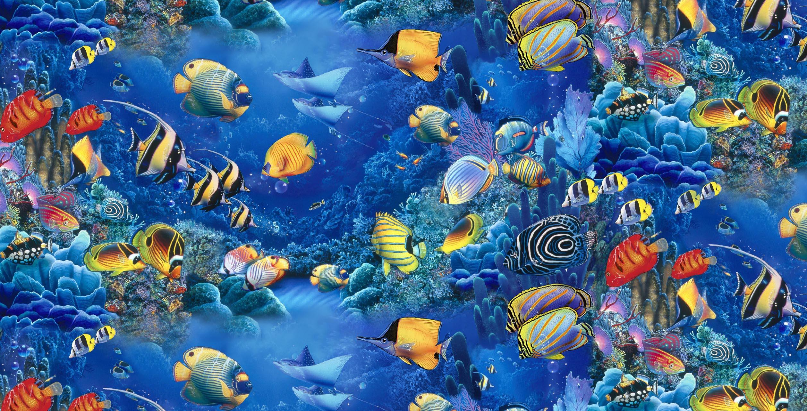
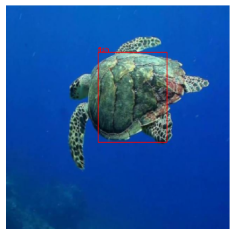
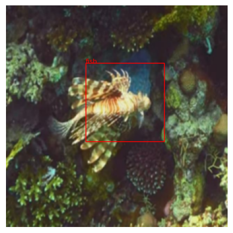
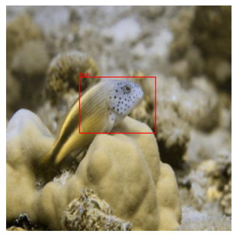
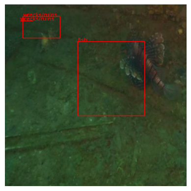

# HydroVision



## Table of Contents
- [Overview](#overview)
- [Introduction](#introduction)
- [Dataset](#dataset)
- [Model Architectures](#model-architectures)
- [Results](#results)
- [Acknowledgements](#acknowledgements)

## Overview

Welcome to HydroVision! This is an underwater object detection project designed to detect various objects in underwater imagery. It leverages lightweight deep learning models that mimic the algorithms of YOLO (You Only Look Once) and Vision Transformer (ViT) architectures, with a focus on achieving decent accuracy using computationally efficient approaches. The project compares three models: a lightweight ViT mimic, a lightweight YOLO mimic, and a combined architecture integrating both approaches.

## Dataset

The dataset used for this project is USIS10K, which consists of underwater images categorized into multiple classes as:

```
class_names = ["wrecks/ruins", "fish", "reefs", "aquatic plants", "human divers", "robots", "sea-floor"].
```

The dataset is structured as follows:

```
data
  ├── USIS10K
  │   ├── multi_class_annotations
  │   │   ├── multi_class_train_annotations.json
  │   │   ├── multi_class_val_annotations.json
  │   │   ├── multi_class_test_annotations.json
  │   ├── train
  │   │   ├── train_00001.jpg
  │   │   ├── ...
  │   ├── train_labels
  │   │   ├── train_00001.txt
  │   │   ├── ...
  │   ├── val
  │   │   ├── val_00001.jpg
  │   │   ├── ...
  │   ├── val_labels
  │   │   ├── val_00001.txt
  │   │   ├── ...
  │   ├── test
  │   │   ├── test_00001.jpg
  │   │   ├── ...
  │   ├── test_labels
  │   │   ├── test_00001.txt
  │   │   ├── ...
```
The annotations are parsed into text files, with each line representing an object in the image in the format:
```
<class_id> <x_center> <y_center> <width> <height>
```

## Model Architectures

Three models are implemented in this project:

1. **Lightweight ViT Mimic**: A simplified Vision Transformer model with fewer transformer blocks and attention heads.
2. **Lightweight YOLO Mimic**: A basic convolutional model inspired by YOLO, with downsampling and prediction heads for bounding boxes and class labels.
3. **Integrated Model (LightViT-YOLO)**: Combines the outputs of the ViT and YOLO mimics for improved performance.

## Results

<div style="display: flex; justify-content: space-around;">
    
    
    
    
</div>

## Acknowledgements

This project would not have been possible without the guidance and support of [**Dr. Shitala Prasad**](https://www.linkedin.com/in/shitalaprasad/), whose expertise and insights were invaluable throughout the development process.

